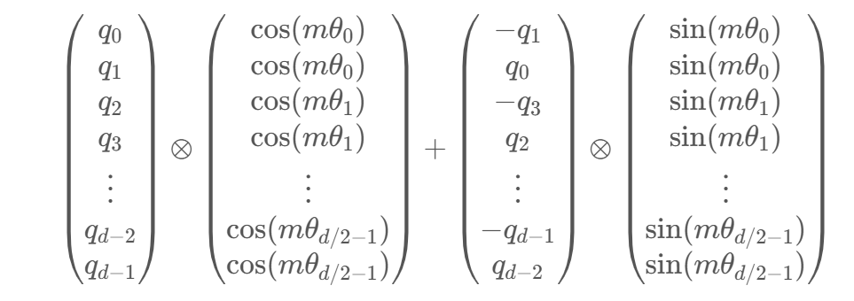
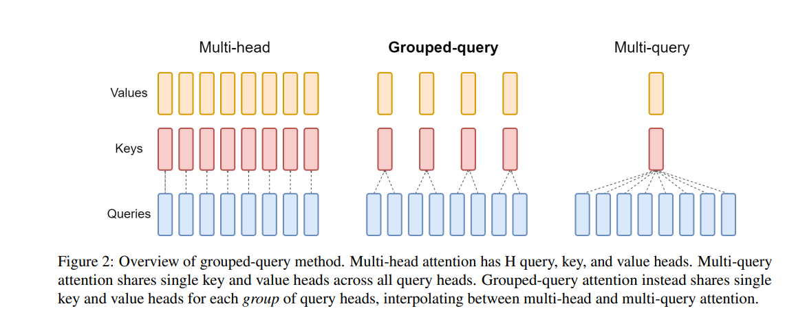
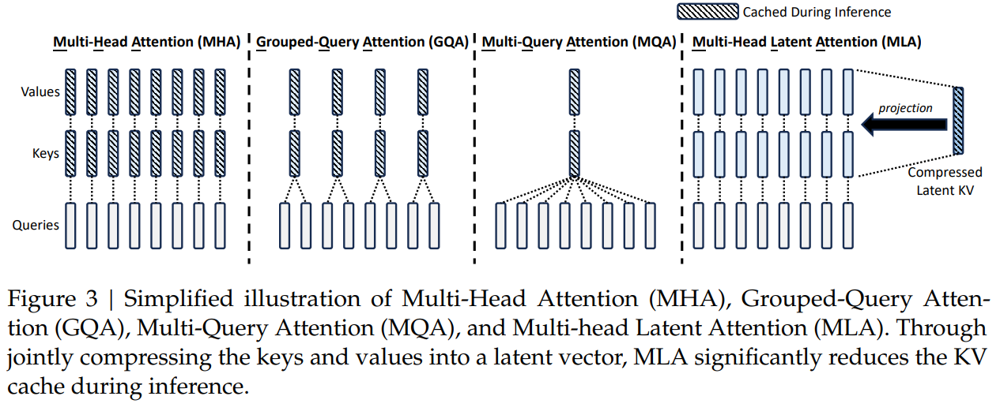
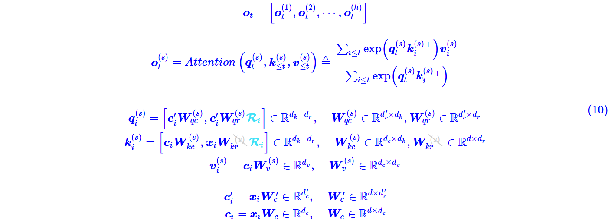
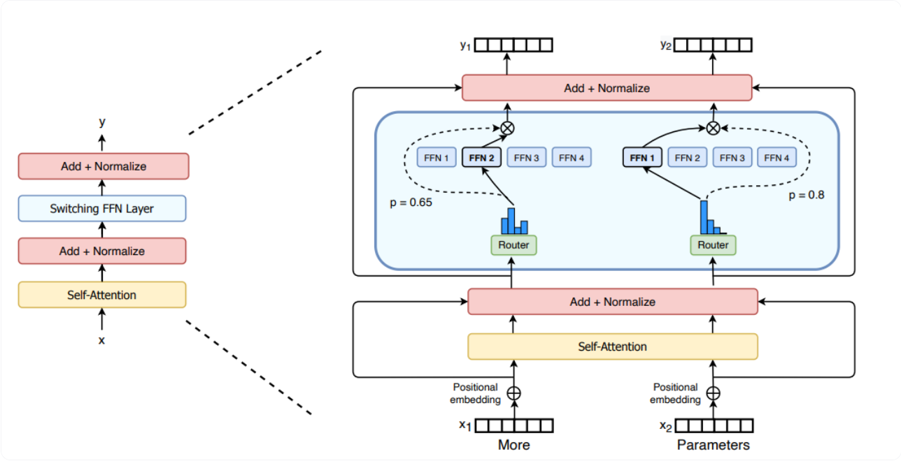
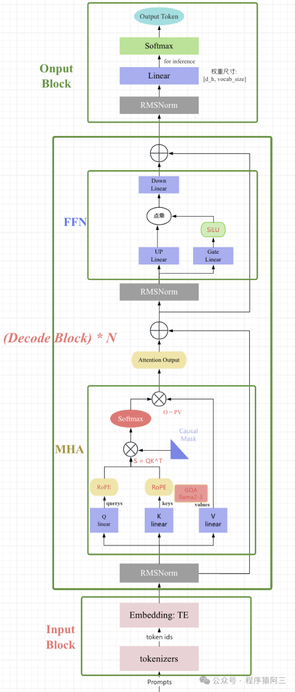

# Chapter 2: Transformer-based LLM

现在的大模型基本是 Transformer-based 的自回归预训练模型，本章我们将以 llama2 以及 GPT-3 为例介绍这种模型的基本结构。

- **Positional Encoding**: RoPE
- **Attention**: Multi-Head Attention or Multi-Query Attention or Grouped-Query Attention or Multi-Head Latent Attention or DeepSeek Sparse Attention
- **Normalization**: LayerNorm or RMSNorm
- **FFN**: MLP or SwiGLU or Mixture of Experts

## Positional Encoding

一般分为两大类：绝对位置编码（Absolute Position Encoding）和相对位置编码（Relative Position Encoding）。本节将介绍这两种位置编码的区别及其重要性，并重点解析一种结合了两者优点的创新方法——旋转位置编码（Rotary Position Embedding, RoPE）

### Why we need Position Encoding

在自然语言处理领域，Transformer 模型已成为一项革命性的技术。然而，其核心的自注意力机制本身并**不具备捕捉序列中单词顺序的能力**，即“位置无关性”。为了解决这一问题，位置编码应运而生。

### 绝对位置编码（Absolute Position Encoding）

给序列中的每个位置一个唯一的向量，把位置信息直接加到 token embedding 上。

1. **固定式**：不用学习参数，能推广到比训练时更长的序列
   在最初的 Transformer 论文《Attention Is All You Need》中，作者使用正弦和余弦函数来生成这些位置编码。其数学表达式如下：

$$
\begin{aligned}
PE_{(pos, 2i)} &= \sin\left(\frac{pos}{10000^{2i/d_{model}}}\right)\\
PE_{(pos, 2i+1)} &= \cos\left(\frac{pos}{10000^{2i/d_{model}}}\right)
\end{aligned}
$$

2. **可学习式**：模型可以学到适合任务的位置信息。训练时没见过的长序列可能无法泛化
   $$
   PE_{pos} = \text{Embedding}(pos)
   $$

### 相对位置编码（Relative Position Encoding）

相对位置编码是根据单词之间的相对位置关系来计算位置编码。这种编码方式更加灵活，**能够捕捉到不同单词之间的相对位置信息**，有助于模型更好地理解序列中单词之间的关系。但是也有缺点，计算效率低下，同时大部分相对编码都没有落地可行性。

### Rotary Position Embedding (RoPE)

将位置编码与词向量通过旋转矩阵相乘，使得词向量不仅包含词汇的语义信息，还融入了位置信息

$$
(R_mq)^T(R_nk) = q^TR_m^TR_nk = q^TR_{m-n}k
$$

给位置为 m 的向量$q$乘上矩阵$R_m$、位置为 n 的向量$k$乘上矩阵$R_n$用变换后的$Q,K$序列做 Attention，Attention 就自动包含相对位置信息

- 相对位置感知：使用绝对位置编码来达到相对位置编码的效果，RoPE 能够自然地捕捉词汇之间的相对位置关系。

- 无需额外的计算：位置编码与词向量的结合在计算上是高效的。

- 适应不同长度的序列：RoPE 可以灵活处理不同长度的输入序列。

#### 目的

我们假设通过下述运算来给$q,k$添加绝对位置信息：
\[
\tilde{q}\_m = f(q, m), \quad \tilde{k}\_n = f(k, n) \tag{1}
\]

也就是说，我们分别为$q,k$设计操作\\(f(\cdot,m),f(\cdot,n)\\)，使得经过该操作后，\\(\tilde{q}\_m,\tilde{k}\_n\\)就带有了位置 m,n 的绝对位置信息。Attention 的核心运算是内积，所以我们希望的内积的结果带有相对位置信息，因此假设存在恒等关系：

$$
⟨f(q,m),f(k,n)⟩=g(q,k,m−n)\tag{2}
$$

所以我们要求出该恒等式的一个（尽可能简单的）解。求解过程还需要一些初始条件，显然我们可以合理地设 \\(f(q,0)=q\\) 和 \\(f(k,0)=k\\)

#### 实现

位置 m 的编码进行解方程，我们得到二维情况下用复数表示的 RoPE：

$$
f(q, m) = R*f(q, m) e^{i \theta f(q,m)}
= \|q\| e^{i(\Theta(q) + m\theta)}
= qe^{im\theta} \tag{3}
$$

矩阵形式：

$$
f(q, m) =
\begin{pmatrix}
\cos (m\theta) & -\sin (m\theta) \\
\sin (m\theta) & \cos (m\theta)
\end{pmatrix}
\begin{pmatrix}
q_0 \\
q_1
\end{pmatrix}
\tag{4}
$$

由于内积满足线性叠加性，因此任意偶数维的 RoPE，我们都可以表示为二维情形的拼接，即

:warning: 由于$R_m$具有稀疏性，不建议使用 matmul 进行实现，建议使用下面的方式实现：其中$\odot$是逐位对应相乘，即 Numpy、Tensorflow 等计算框架中的 ∗ 运算

## Attention Series

- 在 **MHA (Multi Head Attention)** 中，每个头有自己单独的 key-value 对；标准的多头注意力机制，h 个 Query、Key 和 Value 矩阵。
- 在 **MQA (Multi Query Attention)** 中只会有一组 key-value 对；多查询注意力的一种变体，也是用于自回归解码的一种注意力机制。与 MHA 不同的是，MQA 让所有的头之间共享同一份 Key 和 Value 矩阵，每个头只单独保留了一份 Query 参数，从而大大减少 Key 和 Value 矩阵的参数量。
- 在 **GQA (Grouped Query Attention)** 中，会对 attention 进行分组操作，query 被分为 N 组，每个组共享一个 Key 和 Value 矩阵 GQA 将查询头分成 G 组，每个组共享一个 Key 和 Value 矩阵。
  - GQA-G 是指具有 G 组的 grouped-query attention。
    > GQA-1 具有单个组，因此具有单个 Key 和 Value，等效于 MQA。而 GQA-H 具有与头数相等的组，等效于 MHA。

### Multi-Head Latent Attention(MLA)

MLA 通过低秩联合压缩技术，减少了**推理时的键值（KV）缓存**，从而在保持性能的同时显著降低了内存占用

#### 公式

- 在训练阶段，除了多了一步低秩投影以及只在部分维度加 RoPE 外，MLA 与 Q、K 的计算与 MHA 是基本相同的
  > RoPE 的$R_m$计算后投影矩阵与位置相关，为了解决这个问题，对 Q 和 K 的低秩投影分为两部分，**一部分是原始的投影矩阵，另一部分是与位置相关的投影矩阵**
- 在推理阶段，MLA 的计算可以等效为一个 MQA

#### 投影矩阵吸收

在推理阶段，我们利用

$$
q_t^{(s)}k_i^{(s)T} = (x_tW^{(s)}_q)(c_iW^{(s)}_k)^T = x_t(W^{(s)}_qW^{(s)T}_k)c_i^T
$$

将 \\(W^{(s)}\_qW^{(s)T}\_k\\) 合并起来作为 Q 的投影矩阵，那么 $c_i$ 则取代了原本的 $k_i$，同理，在 $o_t$ 后面我们还有一个投影矩阵，于是 \\(v^(s)\_i=c_iW^{(s)}\_v\\) 的 $W^{(s)}_v$ 也可以吸收到后面的投影矩阵中去，于是等效地 $v_i$ 也可以用 $c_i$ 代替，也就是说此时 **KV Cache 只需要存下所有的 \\(c_i\\) 就行**，而不至于存下所有的 \\(k^{(s)}\_i$、$v^{(s)}\_i\\)。注意到 $c_i$跟$(s)$无关，也就是说是所有头共享的，即 **MLA 在推理阶段它可以恒等变换为一个 MQA**。

#### RoPE 解耦

为 RoPE 是一个跟位置相关分块对角矩阵$R_m$，满足$R_mR^⊤_n=R_{m−n}$，MLA 加入 RoPE 之后会让固定的投影矩阵与位置相关：

$$
q^{(s)}_i=x_iW^{(s)}_qR_i,k^{(s)}_i=x_iW^{(s)}_kR_i
$$

$$
q^{(s)}\_tk^{(s)T}\_i=(x\_tW^{(s)}\_q)(c\_iW^{(s)}\_k)^T = x\_t(W^{(s)}\_qR\_{t-i} W^{(s)T}\_k)c\_i^T
$$

这里的 $W^{(s)}_qR_{t-i} W^{(s)T}_k$ 就无法合并为一个固定的投影矩阵了（跟位置差 $t−i$ 相关），从而 MLA 的想法无法结合 RoPE 实现。

**每个 Attention Head 的 Q、K 新增 $d_r$ 个维度用来添加 RoPE**，其中 K 新增的维度每个 Head 共享：

$$
o_t = \big[o_t^{(1)}, o_t^{(2)}, \cdots, o_t^{(h)} \,\big]
$$

$$
o_t^{(s)} = Attention\!\left(q_t^{(s)}, k_{\le t}^{(s)}, v_{\le t}^{(s)}\right)
= \frac{\sum_{i \le t} \exp\!\left(q_t^{(s)} k_i^{(s)\top}\right) v_i^{(s)}}
         {\sum_{i \le t} \exp\!\left(q_t^{(s)} k_i^{(s)\top}\right)}
$$

$$
q_i^{(s)} = [x_i W_{qc}^{(s)},x_i W_{qr}^{(s)}R_i] ,\quad
k_i^{(s)} = [c_i W_{kc}^{(s)},x_i W_{kr}R_i] ,\quad
v_i^{(s)} = c_i W_v^{(s)}, \quad
c_i = x_i W_c
$$

## Normalization

- LayerNorm: 对某个样本的所有特征维度进行归一化

  $$
  \text{LayerNorm}(x) = \frac{x - \mu}{\sigma} \cdot \gamma + \beta
  $$

- RMSNorm: 简化版的 LayerNorm，它不减去均值，只基于平方均值 (Root Mean Square) 来归一化
  $$
  \text{RMSNorm}(x) = \frac{x}{\sqrt{\frac{1}{d}\sum_{i=1}^{d} x_i^2 + \epsilon}} \cdot w
  $$

### Why RMSNorm?

- Layer-Norm 和 RMS-Norm 在测试集效果上没有明显差异，基本持平
- RMS-Norm 的计算效率要更高

## Feed Forward Network (FFN)

- MLP: 两层全连接网络，中间使用非线性激活函数（如 ReLU 或 SiLU）
  $$
  \text{FFN}(x) = \text{ReLU}(0, xW_1)W_2
  $$
- SwiGLU: 使用 SiLU 激活函数的变体并增加门控机制
  $$
  \begin{aligned}
  \text{SwiGLU}(x) &= (\text{Swish}(xW_1)\;\odot\;xW_2) \\
  \text{Swish}(x) &= x \cdot \sigma(x)
  \end{aligned}
  $$
- Mixture of Experts (MoE): 多个专家网络的集合，每个输入样本通过一个路由器选择部分专家进行处理，从而提高模型的表达能力
  - Switch Transformer：Top-1 gating，每个 token 只去 1 个专家。
  - GShard / GLaM：Top-2 gating，每个 token 走 2 个专家，结果加权。
    

## LLAMA2 模型结构

- 相较于 Transformer，llama2 使用了 pre-norm 结构
- 使用 RMSNorm 替代 LayerNorm，不计算样本均值
- 使用 Rotary Positional Encoding (RoPE)，用绝对编码的方式来实现相对位置编码
- 使用 GQA (Grouped-Query Attention)，平衡效率和性能
- 使用 SwiGLU 替代简单的 MLP，激活函数使用 SiLU

  $$
  \begin{aligned}
  \text{SwiGLU}(x) &= \text{Swish}(xW_1+b_1)\;\odot\;(xW_2+b_2) \\
  \text{Swish}(x) &= x \cdot \sigma(x)
  \end{aligned}
  $$

## 参考资料

1. [结构篇| 浅析 LLaMA 网络架构](https://zhuanlan.zhihu.com/p/10815570163)
2. [苏剑林. (Mar. 23, 2021). 《Transformer 升级之路：2、博采众长的旋转式位置编码 》[Blog post]. Retrieved from https://kexue.fm/archives/8265](https://kexue.fm/archives/8265)
3. [苏剑林. (May. 13, 2024). 《缓存与效果的极限拉扯：从 MHA、MQA、GQA 到 MLA 》[Blog post]. Retrieved from https://spaces.ac.cn/archives/10091](https://spaces.ac.cn/archives/10091)
4. [DeepSeek-V2: A Strong, Economical, and Efficient
   Mixture-of-Experts Language Model](https://arxiv.org/pdf/2405.04434)
5. [Root Mean Square Layer Normalization](https://arxiv.org/pdf/1910.07467)
6. [Switch Transformers: Scaling to Trillion Parameter Models with Simple and Efficient Sparsity](https://arxiv.org/abs/2101.03961)
