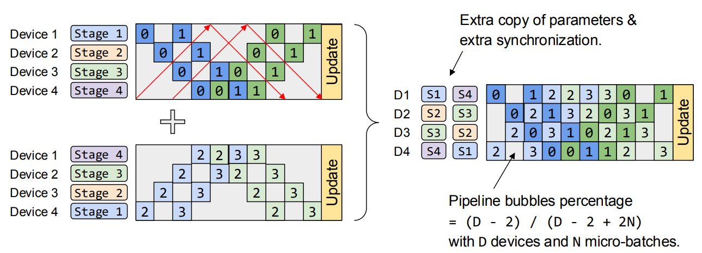
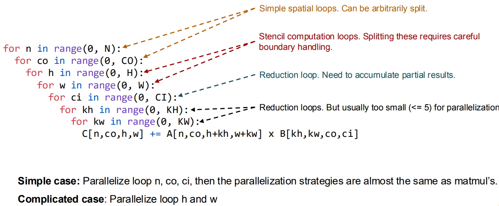

# Parallelization Concepts

本节主要介绍大模型训练中的并行化技术，涵盖数据并行、模型并行、流水线并行和张量并行等方法。我们将从 Transformer 的参数量、Flops 以及训练占用显存入手，分析为什么需要并行化技术，**并介绍这些技术的基本原理**。

下一节我们将以 Transformer-based LLM 为例，对里面 Attention 以及 FFN or MoE 采用的并行化手段进行分析。

## Transformer 模型的参数量、计算量、显存占用

### 参数量

- 每个 transformer 层的参数量为
  $$ \text{Params per layer} = 12h^2 + 13h $$
- 当隐藏维度 $h$ 较大时，可以忽略一次项，模型参数量近似为
  $$ \text{Params per layer} \approx 12lh^2 $$

### 计算量(FLOPs)

- l 层的 Transformer 一次训练迭代计算量：
  $$ \text{FLOPs per iteration} = l\cdot(24hsh^2+4bs^2h)+2bshV $$
  - $l$: Transformer 层数
  - $h$: 隐藏层维度
  - $s$: 序列长度
  - $b$: 批量大小
  - $V$: 词汇表大小
- 当 $h$ 较大且$s \ll h$时，可以忽略低阶项，我们可以近似认为：在一次前向传递中，对于每个 token，每个模型参数，需要进行 2 次浮点数运算，即一次乘法法运算和一次加法运算
- 一次训练迭代包含了前向传递和后向传递，**后向传递的计算量是前向传递的 2 倍**。
  > 一次训练迭代中，**对于每个 token，每个模型参数，需要进行 6 次浮点数运算**

### 显存占用

1. 参数训练时的显存
   - 训练时需要存储模型参数、梯度和优化器状态
   - 每个可训练模型参数都会对应 1 个梯度，并对应 2 个优化器状态（Adam 优化器梯度的一阶动量和二阶动量），使用混合精度训练
     $$
       \text{Total Memory for Parameters} = 20 \times \text{Params num}
     $$
2. 中间激活值的显存
   - 对于 l 层 transformer 模型，中间激活占用的显存大小可以近似为
     $$
         \text{Activation Memory} = (34bsh+5hs^2a)\cdot l
     $$

- 通常会尝试减小批次大小来避免显存不足的问题，这种方式减少的其实是中间激活占用的显存，**而不是模型参数、梯度和优化器的显存**

3. KV Cache 的显存
   - 设输入序列的长度为 $s$ ，输出序列的长度为 $n$ ，以 float16 来保存 KV cache，那么 KV cache 的**峰值显存占用大小**为
     $$
       b(s+n)lh \times 2 \times 2= 4blh(s+n)
     $$
     这里第一个 2 表示 K/V cache，第二个 2 表示 float16 占 2 个 bytes。

## Why Parallelism?

- `Computation Bottleneck`: LLM 的参数量巨大，以 GPT-3 为例，1750 亿参数，对 GPU 计算能力要求极高，单个 GPU 无法满足。(TP, PP, SP)
  > FLOPs 近似 $6 * 1750 * 10 ^9$FLOPs
- `Memory Bottleneck`: LLM 的模型参数和中间激活值占用大量内存，单个 GPU 的显存有限，无法容纳整个模型。(TP, PP, ZeRO, SP)
  > **参数训练时的显存近似 $20 * 1750 * 10 ^9$ bytes 远大于 目前单个 GPU 的显存容量**
  > 中间激活值的显存占用取决于批次大小、序列长度和模型层数，通常也非常大。

## Before Parallelism

:smile:在分布式训练中，GPU 之间的通信必不可少，所以我们需要知道 NCCL 的基本通信原语

- **Minimum Spanning Tree**: HPC 通信常用，最小化通信 ROUND 数
- **Ring Algorithm**: GPU 通信通常有极高的带宽，通信启动带来的延迟并不是主要 bottleneck

**AllReduce:** 将所有 GPU 的数据进行汇总，计算平均值，并将结果广播回所有 GPU，常用于梯度更新

**Broadcast:** 将一个 GPU 的数据发送到所有其他 GPU，常用于模型参数初始化

**Reduce:** 将所有 GPU 的数据汇总到一个 GPU 上，常用于收集结果

**AllGather:** 将所有 GPU 的数据收集到每个 GPU 上，常用于收集中间结果

**ReduceScatter:** 将数据先进行 Reduce 操作，然后将结果分散到各个 GPU 上，常用于分布式计算中的中间步骤

- 其中 **AllReduce 可以看作是 ReduceScatter 和 AllGather 的组合**
  > ZeRO-3 的优化基于此

## Data Parallelism

- **Parameter Server:** workers 存有副本保证容错，PS 收集梯度更新并广播保证一致性
  
- **All-reduce:** 每个 GPU 计算梯度，然后通过 All-reduce 汇总并更新参数，没有容错，但是简单(工业界喜欢简单有效的方案)
  

- [**DDP in PyTorch**](#ddp-in-pytorch)

## Model Parallelism

模型并行原因是因为模型权重过大，单个 GPU 无法容纳或者模型中间激活值过大不能在单个 GPU 上进行完整的一次训练迭代

一般来说，模型并行可以分为**张量并行**和**流水线并行**，以及对 MoE 模型的**专家并行**。

- TP：通信载量很大，一般在小于 8 张 GPU 的场景下使用
- PP：通信载量较小，模型分割比较独立

### Pipeline Parallelism

把模型切分多个 stage，每个 device 负责一个 stage 的计算，类似 CPU 的 pipeline，问题变成了**如何让 pipeline 的 bubbles 尽可能少**

- 实际上 llm 推理和训练的 pipeline 并不完全一样，推理的 pipeline 更简单，因为不需要反向传播，而训练的话需要考虑反向传播和梯度更新。**反向传播和梯度更新对前向传播有依赖**
  

#### Device Placement

- 只对特殊的有分支的模型有效
  

#### Synchronous Pipeline Parallelism

- Idea: 尽可能减少 Pipeline Bubbles
- Pros: 保证收敛语义，训练过程和在单张卡上相同
- Cons:
  - compute: 流水线气泡
  - compute: 为了消除流水线气泡，我们必须切分 input 变成更小的 micro-batches，**但是 micro-batch 太小会影响硬件计算的效率($AI \space = \space \#ops \space/ \space \#bytes$)**
    > 算法上其实对 global batch size 也有限制

##### GPipe

把 input 切分成多个 micro-batches，把 micro-batches 依次送入 pipeline。梯度计算如下：

$$
\nabla L_{\theta}(x) = \frac{1}{N} \sum_{i=1}^{N} \nabla L_{\theta}(x_i)
$$

- **Memory Usage 问题：** 存在一个不停增长内存的阶段直到峰值，因为每个 micro-batch 的中间激活值都需要存储直到开始反向传播

  

##### 1F1B & Interleaved 1F1B

- **1F1B**: 并没有降低 GPipe 的延迟，只是改变了调度的顺序，尽可能优先地执行反向传播
  

- **Interleaved 1F1B**: 切分成更细粒度的 stage，每个 GPU 负责多个不邻近的 stage
  
  

  > 有 16 transformer layers （L1 to L16），他们被均匀地分配到四个 devices 上
  > Device 1: [L1, L2], [L9, L10]
  > Device 2: [L3, L4], [L11, L12]
  > Device 3: [L5, L6], [L13, L14]
  > Device 4: [L7, L8], [L15, L16]

  > 这样的话，一个数据在执行了 device 4 的 L7, L8 之后，可以转到 device 1 继续 L9 L10；这也**不耽误 device 4 继续接受来自 forward/backward 的计算任务了**。

  

##### TeraPipe

专门针对 autoregressive 系列模型设计的 pipeline 并行，**把多个 Transformer layer 堆叠成一个 stage**，每个 GPU 负责多个 stage

> 每个 token 仅仅只依赖前面的 token，

##### Chimera

提出双向流水线 (bi-directional pipeline)，即同时在 forward 阶段和 backward 阶段并行运行不同 micro-batch(DeepSeek 使用)

##### Zero Bubble Pipeline Parallelism

- **Motivation:** backward 需要 forward 的两倍的时间开销，forward 只有一个 wx 乘法；而 backward 里面有两个乘法，将 backward 拆成对 Input 的 backward 和对 weight 的 backward 两个部分

  > **当前 layer 的 backward 只依赖对上一个 layer 的 input 的 backward(B)，不依赖 weights 的 backward(W)**

  

- **ZB-H1**：device 1 的峰值内存与 1F1B 相比没有变化，其他 device 相对增加，但是 bubble 减少了 2/3
  

- **ZB-H2**：device 1 的峰值增加到 2 \* 1F1B，bubbles 接近为 0

  - :warning: 这里实际上有一个问题，optimizer 一般需要全局同步，但是 ZB-H2 里每个 device 都有自己的 optimizer state，需要额外的机制来实现
    

  - **optimizer sync:** 为了进行梯度裁剪，需要计算全局梯度范数；在混合精度训练中，需要对所有参数进行全局 NaN/INF 检查。

    > 当梯度的“整体大小”超过某个阈值时，就把它按比例缩小。

    

  - 实际上触发梯度裁剪和 NaN/INF 检查的频率并不高，所以异步进行每个阶段的 gradients 检查

    > 这里在每个流水线阶段执行优化器步骤之前，该阶段会从前一个阶段接收一个部分归约（partially reduced）的全局状态，将其与本阶段的本地状态（local state）合并后，再传递给下一个阶段。如果最后发现需要裁剪梯度或者发现 NaN/INF，进行 rollback，**丢弃此次更新即可**。

    

- **ZB-V**: ZB-H2 结合 Interleaved 1F1B，通过这种方式将集群峰值内存降低到 1F1B 的水平，同时保持接近零的流水线气泡

  

- Comparison of different PP methods

  

##### DualPipe(DeepSeek-V3 Used)

- 流水线稳定的标准：
  
  - 双向管道都已“灌满”：
    > 第一个流水线（F0）的第一个前向块（黄色的 0）必须已经走完了全程，从 Device 0 到达了 Device 7。
    > 第二个流水线（F1）的第一个前向块（橙色的 10）也必须已经走完了全程，从 Device 7 到达了 Device 0。
  - 双向反向传播都已开始：
    > 当 F0 的块 0 到达 Device 7 后，它的反向传播 B0（绿色的 0）就可以从 Device 7 开始，并向着 Device 0 的方向回传。
    > 当 F1 的块 10 到达 Device 0 后，它的反向传播 B1（比如 T=8 时 Device 4 上的橙色块 10）就可以从 Device 0 开始，并向着 Device 7 的方向回传。
- Overlap 计算和通信

  

- 完整的 DualPipe 调度

  

- :warning: 下面的图里，有两个 X，代表 bubble，即，**device 2 需要等待 device 3 传递过来 14+0 的执行结果之后，才可以自己执行。**

  

#### Asynchronous Pipeline Parallelism

- Idea: 在反向传播完成之前开始下一阶段的前向传播
- Pros: No pipeline bubbles
- Cons:
  - compute: 打破了同步训练语义(**forward 和 backward 必须匹配同一份权重**)，训练过程中可能有滞后 gradient
  - memory: 算法会存储多个版本的 weights 来保证一致性

**AMPNet**: 完全异步。每个设备在空闲时就执行前向传播，并在每次反向传播后更新权重。

- Techniques:
  - Task Queue: 每个计算单元维护一个本地队列，forward 和 backward 都被表示为任务。任务只有在依赖的数据 (activation 或梯度) 到达时，才会被触发
  - AMPNet 引入了**依赖计数 (dependency counter)**，当所有依赖满足时，任务才能被调度执行。
- Pros: **No pipeline bubbles**
- Cons:
  - :sob:**只在本地更新权重，没有全局同步**。小数据集上可以很好的泛化，但是大数据集上很难
  - activation 缓存造成 memory overhead(forward 结果需要存储直到 backward)

**Pipedream**: 每个 batch 存储多个权重版本(类似 MVCC)

- Techniques:
  - Weight Versioning:
    1. forward 时保存一份当前参数快照 (stash)。
    2. backward 时必须使用对应 forward 时的那份参数（确保一致性）。
    3. 更新是异步的，但保证 forward/backward 用的是同一版本的权重。
  - 采用 1F1B (one forward, one backward) pipeline 调度。
- :skull: **No Memory saving compared to single device case, which is opposite to the purpose of model parrallelism**

**Pipedream-2BW**: 只保留 2 个版本的权重

- Techniques:

  - 每个 stage 只保留 两个版本的权重（current 和 previous）。不需要为每个微批次 stash weight，大幅降低显存占用。
  - **forward 总是用前一版本**（stalled by 1 update）
  - 调度：改进了 1F1B 调度，使得在 forward/backward 之间能更高效复用 weight。

#### RL-Based Partitioning Algorithm

将计算图分 stage 问题变成一个强化学习问题

#### Optimization-Based Partitioning Algorithm

讲求解划分问题变成一个整数线性规划问题

### Tensor Parallelism

#### Parallelize One Operator

- **Manual**: 枚举所有可能的划分方式，选择在你环境限制下最优的划分方式
  

#### Re-partition in Tensor Parallelism

不同的 op 并行策略要求 tensor 的形状不同，通信开销也不同

#### Parallelize All Operators in a Computation Graph

**Problem Definition**:

- 给定一个计算图，选择一个划分策略，使得 Node costs(计算开销+通信开销) + Edge costs(re-partition 通信开销) 最小
  

##### Model-specific Intra-op Parallel Strategies

**AlexNet**

**Megaton-LM**

- f 和 g 是共轭的。 f 在正向传播中是恒等算子，在反向传播中是所有 reduce 操作，而 g 在正向传播中是所有 reduce 操作，在反向传播中是恒等操作
  

**Gshard-MoE**

- 除了 MoE 层分布式在多个设备上，其他层都 copy 到每个设备上
- 一次 forward 和 backward 分别需要 2 次 all-to-all 操作
  > 路由分发 token 到不同的专家，将路由到自己专家的输入 gather

##### Systems for Intra-op Parallelism

**ZeRO Optimizer**: 解决数据并行中内存瓶颈，将 gradients, optimizer states and model weights 分区并分发到不同设备上

> 这里 Optimizer States 使用了 Adam 优化器，需要为每个参数额外存储一阶动量 + 二阶动量 + 参数副本(fp32 copy)，ZeRO 论文中使用了 **FP16 + FP32 混合精度训练**，所以会存储两倍的 Optimizer States

**ZeRO 2**: 不仅将 optimizer states 分布到不同设备上，还将 gradients 分布到不同设备上

**ZeRO 3**: 将模型参数也分布到不同设备上，但是增加了通信开销

##### Automatic Parallelization Methods

- [**Alpa**](#alpa)

### Summary for Parallelism Concepts

#### Why we do not use automatic parallelization in LLM?

因为 LLM 现在的架构基本是 Transformer，Transformer 的计算图比较简单，**手动设计的并行策略已经足够好，并且自动并行化方法的搜索空间和计算开销都比较大，收益不明显**。

## 参考资料

1. [分析 transformer 模型的参数量、计算量、中间激活、KV cache](https://zhuanlan.zhihu.com/p/624740065)
2. [NCCL 官方文档](https://docs.nvidia.com/deeplearning/nccl/user-guide/docs/usage/operations.html#allgather)
3. [Zero Bubble Pipeline Parallelism](https://arxiv.org/abs/2401.10241)
4. [Deepseek-v3 技术报告-图的逐步解析-4-DualPipe](https://zhuanlan.zhihu.com/p/22681871459)
5. [DeepSeek-V3 Technical Report](https://arxiv.org/pdf/2412.19437)

## 附录

### [DDP in PyTorch](#data-parallelism)

#### Original Solution

1. 从相同的模型状态开始
   > 在 DDP 构建时将模型状态从一个进程广播到所有其他进程来实现
2. 在每次迭代中消耗相同的梯度来保证正确性。

   > 一个简单的解决方案可以在本地反向传播之后和更新本地参数之前插入一个梯度同步阶段。

   > DDP 可以注册 autograd 钩子以在每个反向传播后触发计算。当触发时，每个钩子会扫描所有本地模型参数，并从每个参数中检索梯度张量。

   > 然后，它使用 AllReduce 集体通信调用来计算所有进程中每个参数的平均梯度，并将结果写回梯度张量。

实际上这种方案导致了性能问题：

- 集群通信在小 tensor 上效率低下
- 因为将梯度计算和同步分开，无法重叠计算和通信

#### Improved Technique

1. Gradient Bucketing: DDP 可以通过等待一段时间并将多个梯度合并到一个 AllReduce 操作中，实现更高的吞吐量和更低的延迟。**为了重叠计算和通信，DDP 不应在一次 AllReduce 中通信所有梯度，否则在计算完成之前无法开始通信**
2. Overlap Computation with Communication: 使用桶划分，DDP 只需要等待同一桶中的所有内容都准备好后才开始通信。**DDP 为每个梯度累加器注册了一个自动微分钩子。钩子在相应的累加器更新梯度后触发**，并将检查它所属的桶。如果同一桶中所有梯度的钩子都已触发，最后一个钩子将触发该桶的异步 AllReduce。

:skull:**Attentions**

- 所有进程必须使用相同的桶排序顺序，并且没有进程可以在启动桶 i+1 之前启动桶 i 的 AllReduce

  > （a）显示了一个例子，其中两个垂直轴代表时间，虚线表示梯度何时准备好。在进程 1 中，四个梯度按顺序计算，但在进程 2 中，梯度$g_2$是在$g_3$和$g_4$之后计算的。在这种情况下，如果所有进程在准备好后立即进行 AllReduce，AllReduce 内容将不匹配(**$g_2$还没有计算完成，结果不正确**)

  > PyTorch v1.5.0 通过使用 model.parameters()的逆序作为桶排序顺序来解决这个问题，假设层很可能按照与它们在正向传递中调用的相同顺序注册。 因此，反向顺序应大致代表反向传播中的梯度计算顺序

- 对于跳过的梯度，DDP 可以通过在**正向传播结束时主动将它们标记为就绪**来避免等待其余参数梯度

  > 由于梯度到桶的映射是在构建时确定的，那些缺失的梯度会导致一些桶从未看到最终的 autograd 钩子，从而未能将桶标记为就绪。因此，反向传播可能会挂起

  > （b）显示了一个例子，其中一个迭代中跳过了对应梯度$g_3$的参数，导致桶 2 永远不会准备好

#### DistributedDataParallel Algorithm

### [Alpa](#automatic-parallelization-methods)

#### Techniques

- 分层抽象 (Hierarchical Abstraction)：把大问题拆分成两层：

  - Inter-Operator Parallelism（算子级别并行） → 决定每个 layer/module 怎么切（DP, PP, TP）。
  - Intra-Operator Parallelism（算子内并行） → 针对矩阵乘法、卷积等操作进一步做张量切分。

- 两阶段搜索 (Two-level search)：
  - Stage 1: 通过动态规划（DP）+ cost model，在 operator graph 层面找到最优划分。
  - Stage 2: 在每个 operator 内部，用 ILP / search 确定最佳 intra-op parallelism。
- 编译器支持 (Compiler-based)：
  - Alpa 构建在 XLA 上，可以自动生成 SPMD (single program multiple data) 程序。
  - 通过 parallel execution plan → lowered to XLA SPMD → 映射到 GPU/TPU。

#### 搜索空间

对于 computation block，Alpa 允许 DP PP TP 以及他们的组合

  
#### Search Methods

- Inter-Operator 层级：把模型分成多个 stage 分配给不同的 mesh。每个 segment 选择一个并行方式（DP / PP / TP）。动态规划搜索 segment 划分，利用 cost model 评估执行的延迟。

  
  

- Intra-Operator 层级：对每个算子，枚举可能的 tensor 切分方式。用 ILP 找到代价最低的方案。

  

