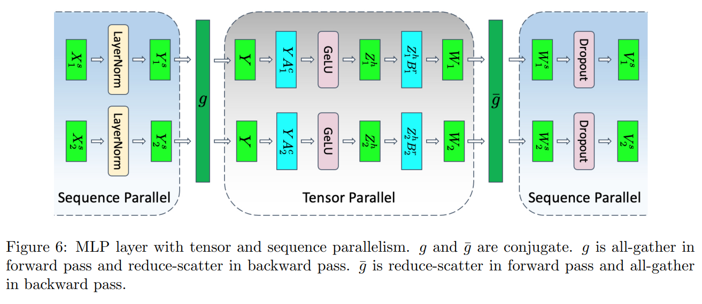
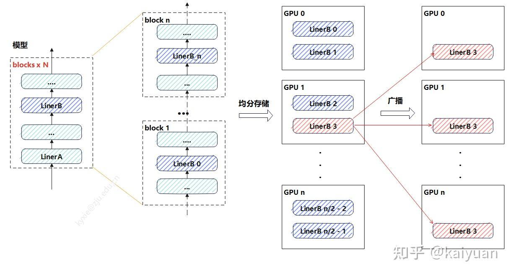
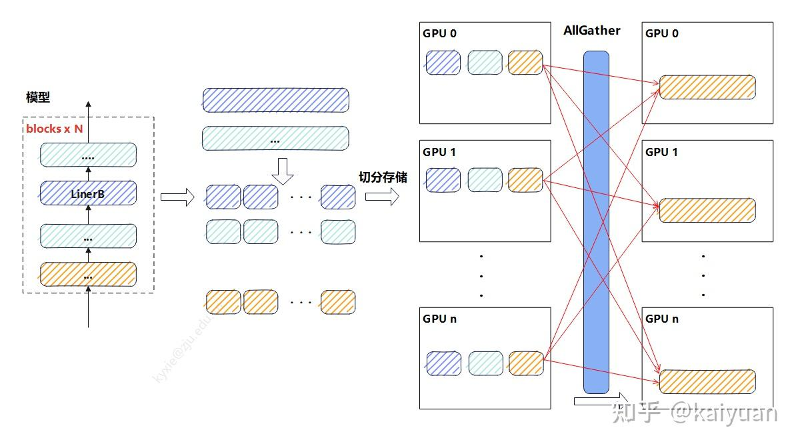
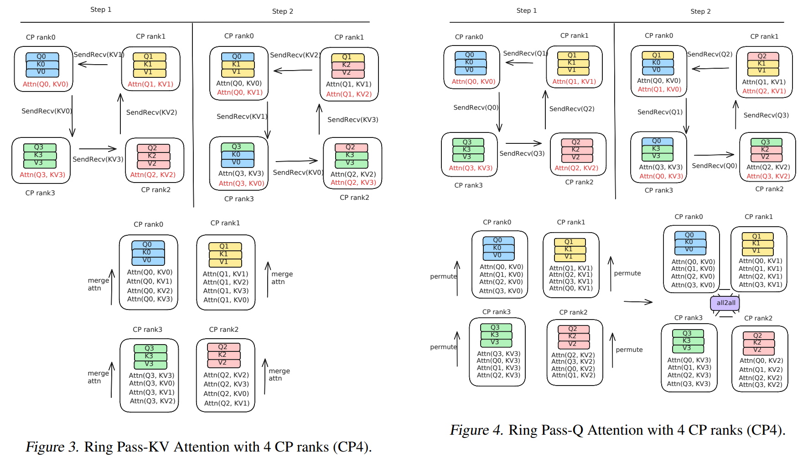
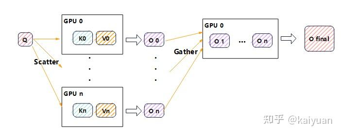
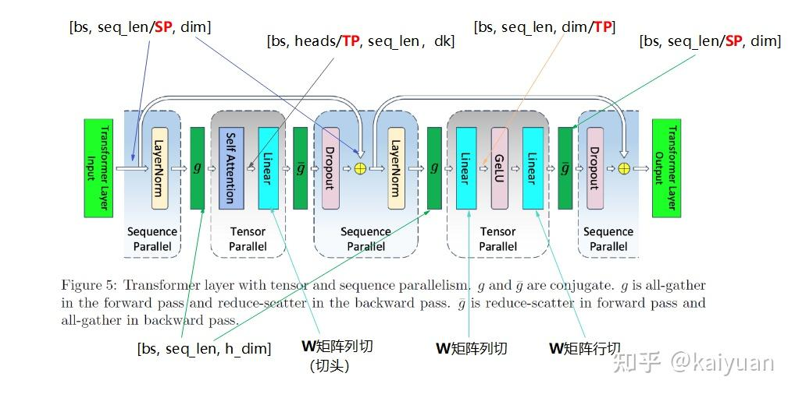

# Parallelism in Transformer-Based LLM

- **DP:** LLM 训练常结合 ZeRO 使用，减少 optimizer/gradient/weight 的冗余。
- **PP:** DeepSeek 使用了 Dualpipe，大多数都会使用 1F1B
- **TP:** Megaton-LM 的 attention 算子并行和 matmul 并行
- **Expert Parallelism:** MoE 层的专家并行，GShard-MoE
  - :laughing:Inference 越来越常见
- **SP(Sequence Parallelism)/CP(context parallelism)**: 超长上下文 LLM 训练使用

接下来我们将以 Transformer-based LLM 为例，分析 Attention 和 FFN or MoE 采用的并行化手段(Training & Inference)

## MLP Parallelism

MLP 的并行运算，包括层内切分、层间切分以及参数冗余消除，并行方式包括了数据并行（DP）、序列并行(SP)、张量并行（TP）、层并行（PP）、参数冗余消除（Zero）

### 层内并行

- DP: batch size 切分
- SP: seq len 切分
- TP: hidden size 切分
  $$ activation size:[batch\_size, seq\_len, hidden\_size]$$

SP 和 TP 通常一起使用，因为 **TP 仅仅切分了 weights**，而 input 没有切分，GPU 上仍然保存完整的 输入计算的 activation，而 **SP 则切分了 activation**

- 对于 MLP 来说，SP 是比较容易的，

**Example**
**megatron-v3 中使用 SP+TP 来减小 activation 的大小**，TP 的计算过程类似 MatMul Parallelism 的描述

- **MLP TP**
  在 A x B x C 矩阵乘法场景，B 矩阵列切， C 矩阵行切。**计算量减半，多了一次集群通信（allReduce）中间值的存储大小减半，Input, Weight 减半**

  

- 因为 GeLU 非线性，必须使用 allGather 来收集 activation
  

### 层间并行

**Pipeline Parallelism，Expert Parallelism，Attention-FFN Decoupling**

现在的普遍做法是 AFD(Attention-FFN Decoupling)，这是一种**层间异构并行策略**，把 Transformer 里的 Attention 和 MoE-FFN 拆开到不同设备上执行，以适配它们算力/显存需求的差异，从而提高推理吞吐和硬件利用率，MoE 的不同专家也分配到不同的 GPU 上

- Attention 是 Matmul + softmax + activation，通常是访存瓶颈（memory access bound）
- FFN 是占用显存大，算力要求高，通常表现为计算瓶颈（compute bound）
  

### 冗余参数消除

一般使用 ZeRO，将参数分散存储

- 模型参数较小时，一般选择参数广播

  

- 参数较大时，将每一层的权重 n 等分，每个 GPU 设备上面存一份，当需计算时将其 allgather 回来。

  

## Attention Parallelism

- DP: batch size
- TP: heads & $d_k$
- SP/CP(context parallelism): seq_len
  $$attention \space size: [batch\_size, heads, seq\_len, d_k]$$

Attention 的层间并行、冗余参数消除方式与线性层的方式一致，**层内并行的主要差异是 TP 和 SP**

### Sequence Parallelsim

#### Motivation

self-attention 的内存需求是输入长度（sequence length）的 2 次方。其复杂度为 \\(O(n^2)\\)
，其中，n 是序列长度。换言之，长序列数据将增加中间 activation 内存使用量，从而限制设备的训练能力。

这里出现了三种切分方式：

- 只切分 Q 的序列
  Q 的切分后的尺寸为$[bs, heads, seq\_len/SP, head\_dim]$，按照 attention 计算：
  1. 求解 score，Q x K 相当于左矩阵行切，score 尺寸：$[bs, heads, seq\_len/SP, seq\_len]$
  2. softmax 求解的是最后一个维度，计算元素值相同，得到 attention_weights，
  3. attention_weights 与 V 进行矩阵乘，还是左矩阵行切运算，元素值相同，计算得到 O 的分块结果
  4. **将计算的 O 进行 allgather，结果相等**。

:warning: 虽然计算上可行，但每个 GPU 都需要一份完整的 K 和 V，没有节省下长序列带来的巨大 KV Cache 内存开销，这违背了 SP 的初衷。

- 只切分 K 的序列
  score 尺寸是$[bs, heads, seq\_len, seq\_len/SP]$，进一步计算 softmax，由于最后一个维度的数据只有之前的一半长度，而 softmax 的计算跟整个序列相关，直接拼接会导致结果不相等。所以，**单独切 K 序列后拼接，结果不等**
- 只切分 V 序列
  得到 attention_weights 尺寸完整，计算 attention_weights x V，因为 V 矩阵被行切，所以 attention_weights 需要列切(Matmul parallelism 的图)，**最后 allreduce 能够获得完整结果**

:warning: softmax 计算需要完整的 score 矩阵，内存瓶颈没有解决

当前常用的方式：QKV 按照相同方式切分，然后对 softmax 修正：

- 数据协同切分：每个切分 Qi 要与所有的 Ki、Vi 进行一次计算，得到 Oi，尺寸均为$[bs, heads, seq\_len/N, head\_dim]$，$N$是 sp 的并行度
- 分块计算与通信：每个$Rank_i$ 的目标是计算出它所负责的输出 $O_i$。要计算 $O_i$，$Q_i$ 必须和所有的 $K_j$ 与 $V_j$（其中 $j=0, 1, ..., N-1$）进行交互。这通过通信实现（例如，All-to-All 或者 Ring AllGather）。
- 在线 Softmax 修正：在与每个 $K_j$, $V_j$ 块交互计算时，不能直接计算局部的 softmax 然后相加。必须使用一种**在线（Online）或流式（Streaming**的算法来迭代地更新 softmax 的结果，从而保证最终结果与全局计算完全一致。
  

#### prefill

推理的 prefill 阶段，Q 的序列长度与 KV 保持一致，**开启 SP 后 GPU 之间需要交换 KV 值与 Q 进行运算**

- 每个 rank 的 Q 与 KV 匹配计算完后获得三个输出值，然后进行结果修正得到$[O_{X0}, O_{X1}, O_{X2}]$，X 值为 rank 序号。最后每个 rank 将自己的分块结果进行聚合（加法）运算得到结果 $O_X$。

  > 类似分布式的 flash attention
  > 可以选择 pass Q 或者 pass KV

  

#### decode

在 decode 阶段 Q 的长度为 1，若对应的 KV 值分散在各个 GPU 设备中，可以将 Q 复制 N 份与切片的 KV 值进行 attention 计算后，最后将结果 gather 到一个设备上再计算修正结果。

- 这个方式意味着 GPU0 需要完成最大值、修正运算、求和运算，GPU0 可能成为瓶颈。一种 Tree attention 算法对过程做了改进，提升了通信效率。**就是把 gather 换成多次 allreduce，这种方式在跨节点场景中优势明显**。

### Tensor Parallelism

Attention 的张量并行分为两个部分:QKV 运算、线性投影运算。

QKV 运算的 TP 切分一般**针对 heads 维度**，相当于矩阵的并行的批量运算。

- attention 按照 heads 进行切分
- linear 按照 hidden_size / heads 进行切分
  

## DeepSeek-V3 Inference Parallelism

DeepSeek 一共有 61 层，但并非每层都采用 MoE 结构，前 3 层依然是只有 1 个 MLP 的 Dense 层

### Prefill

- **Compute:**
  - Attention: TP4 + SP + DP8 [^deepseekv3]
    > TP4 是为了降低通信开销
  - FFN: EP32 + TP
    > Dense MLP（浅层）部分：TP1（无张量并行）
- **Scheduler:** 同时处理两个 micro-batch；
  - 在一个 micro-batch 做 Attention + MoE 计算时，
  - 另一个 micro-batch 正在进行 token 的 dispatch/combine（all-to-all 通信）。
  - 用流水线（pipeline）方式在 micro-batch 级别做并行计算与通信重叠

### Decode

- **Compute:**

  | 模块               | 并行策略            | 说明                                                           |
  | ------------------ | ------------------- | -------------------------------------------------------------- |
  | **Attention 部分** | **TP4 + SP + DP80** | Tensor Parallel 4 路 + Sequence Parallel + Data Parallel 80 路 |
  | **MoE 部分**       | **EP320**           | Expert Parallel 320 路，每张 GPU 承载一个专家                  |

  > 每张 GPU 上只有 1 个专家；320 个专家覆盖所有 GPU；另有 64 张 GPU 专门放置冗余专家和共享专家。

- **Scheduler:** 和 prefilling 阶段类似，他们尝试并行处理两个微批（micro-batch）；在解码阶段，Attention 占用的计算时间更多；因此采用新的重叠方式：
  | 阶段 | micro-batch A | micro-batch B |
  | ----- | ------------------------ | ------------------------ |
  | 时间片 1 | Attention | Dispatch + MoE + Combine |
  | 时间片 2 | Dispatch + MoE + Combine | Attention |

## 参考资料

[^1]: [Sequence Parallelism: Long Sequence Training from System Perspective](https://arxiv.org/abs/2105.13120)
[^2]: [ring attention + flash attention：超长上下文之路](https://zhuanlan.zhihu.com/p/683714620)
[^3]: [Tree Attention: Topology-aware Decoding for Long-Context Attention on GPU clusters](https://arxiv.org/pdf/2408.04093)
[^deepseekv3]: [DeepSeek-V3 Technical Report](https://arxiv.org/abs/2412.19437)
