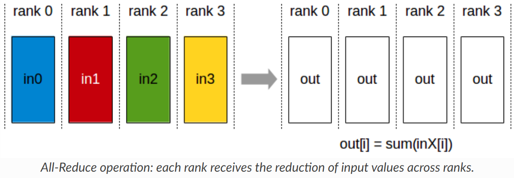
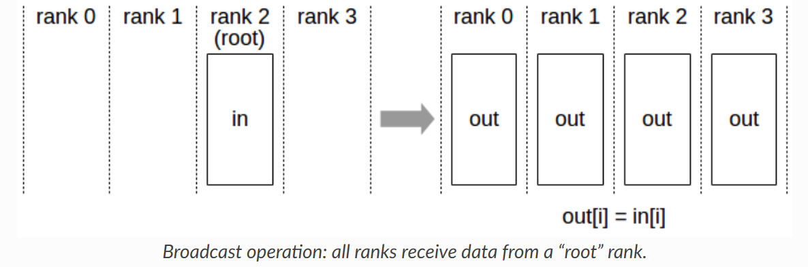
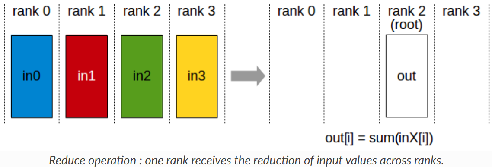
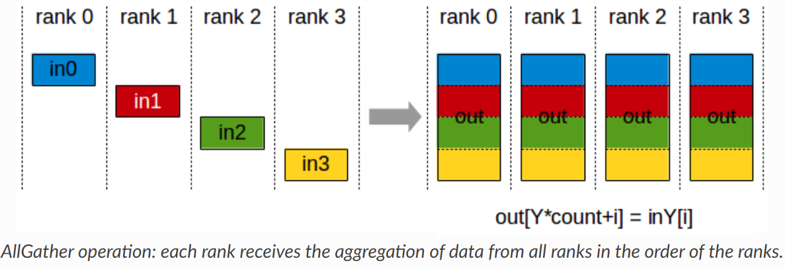
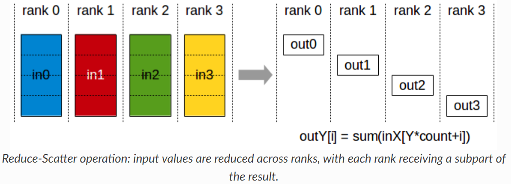
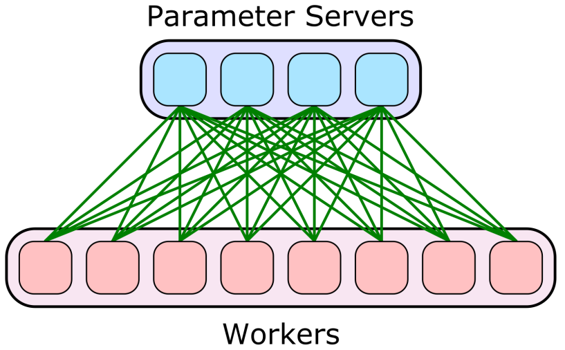
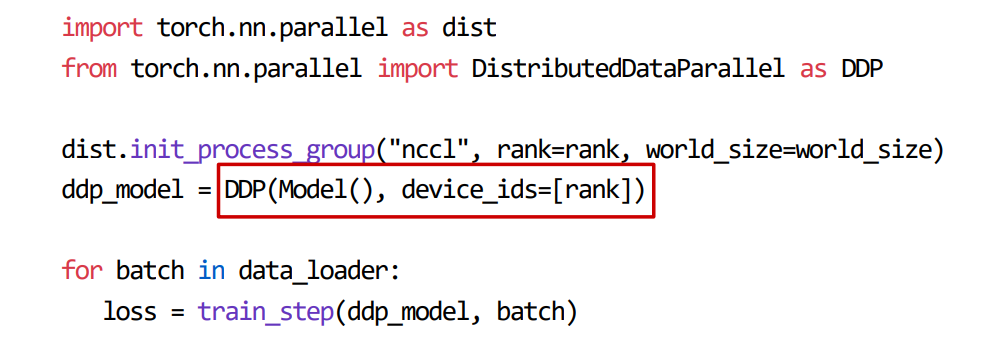
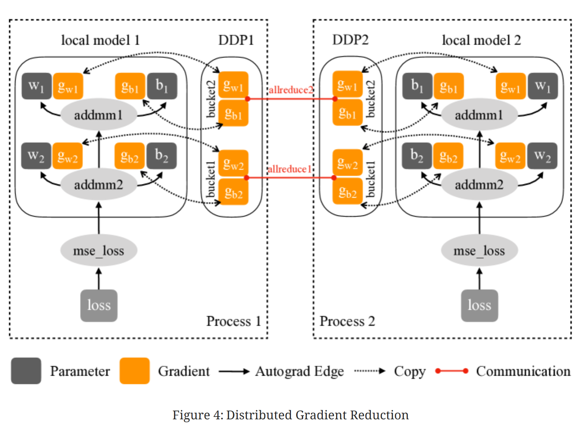
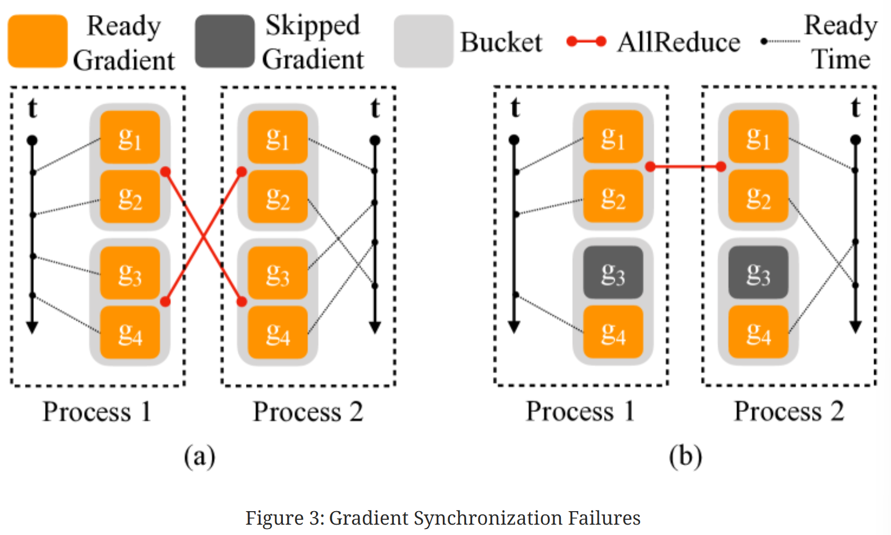
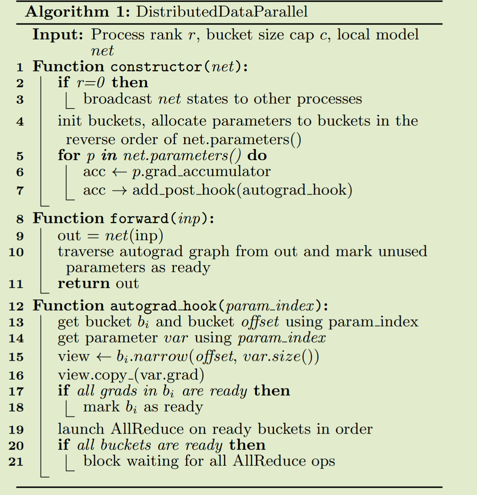

# Chapter 3: Parallelization in LLM

本节主要介绍大模型训练中的并行化技术，涵盖数据并行、模型并行、流水线并行和张量并行等方法。我们将从 Transformer 的参数量、Flops 以及训练占用显存入手，分析为什么需要并行化技术，**并介绍这些技术的基本原理**。最后我们将以 Transformer-based LLM 为例，对里面 Attention 以及 FFN or MoE 采用的并行化手段进行分析。

## Transformer 模型的参数量、计算量、显存占用

### 参数量

- 每个 transformer 层的参数量为
  $$ \text{Params per layer} = 12h^2 + 13h $$
- 当隐藏维度 $h$ 较大时，可以忽略一次项，模型参数量近似为
  $$ \text{Params per layer} \approx 12lh^2 $$

### 计算量(FLOPs)

- l 层的 Transformer 一次训练迭代计算量：
  $$ \text{FLOPs per iteration} = l\cdot(24hsh^2+4bs^2h)+2bshV $$
  - $l$: Transformer 层数
  - $h$: 隐藏层维度
  - $s$: 序列长度
  - $b$: 批量大小
  - $V$: 词汇表大小
- 当 $h$ 较大且$s \ll h$时，可以忽略低阶项，我们可以近似认为：在一次前向传递中，对于每个 token，每个模型参数，需要进行 2 次浮点数运算，即一次乘法法运算和一次加法运算
- 一次训练迭代包含了前向传递和后向传递，**后向传递的计算量是前向传递的 2 倍**。
  > 一次训练迭代中，**对于每个 token，每个模型参数，需要进行 6 次浮点数运算**

### 显存占用

1. 参数训练时的显存
   - 训练时需要存储模型参数、梯度和优化器状态
   - 每个可训练模型参数都会对应 1 个梯度，并对应 2 个优化器状态（Adam 优化器梯度的一阶动量和二阶动量），使用混合精度训练
     $$
       \text{Total Memory for Parameters} = 20 \times \text{Params num}
     $$
2. 中间激活值的显存
   - 对于 l 层 transformer 模型，中间激活占用的显存大小可以近似为
     $$
         \text{Activation Memory} = (34bsh+5hs^2a)\cdot l
     $$

- 通常会尝试减小批次大小来避免显存不足的问题，这种方式减少的其实是中间激活占用的显存，**而不是模型参数、梯度和优化器的显存**

3. KV Cache 的显存
   - 设输入序列的长度为 $s$ ，输出序列的长度为 $n$ ，以 float16 来保存 KV cache，那么 KV cache 的**峰值显存占用大小**为
     $$
       b(s+n)lh \times 2 \times 2= 4blh(s+n)
     $$
     这里第一个 2 表示 K/V cache，第二个 2 表示 float16 占 2 个 bytes。

## Why Parallelism?

- `Computation Bottleneck`: LLM 的参数量巨大，以 GPT-3 为例，1750 亿参数，对 GPU 计算能力要求极高，单个 GPU 无法满足。(TP, PP, SP)
  > FLOPs 近似 $6 * 1750 * 10 ^9$FLOPs
- `Memory Bottleneck`: LLM 的模型参数和中间激活值占用大量内存，单个 GPU 的显存有限，无法容纳整个模型。(TP, PP, ZeRO, SP)
  > **参数训练时的显存近似 $20 * 1750 * 10 ^9$ bytes 远大于 目前单个 GPU 的显存容量**
  > 中间激活值的显存占用取决于批次大小、序列长度和模型层数，通常也非常大。

## Before Parallelism

:smile:在分布式训练中，GPU 之间的通信必不可少，所以我们需要知道 NCCL 的基本通信原语

- **Minimum Spanning Tree**: HPC 通信常用，最小化通信 ROUND 数
- **Ring Algorithm**: GPU 通信通常有极高的带宽，通信启动带来的延迟并不是主要 bottleneck

**AllReduce:** 将所有 GPU 的数据进行汇总，计算平均值，并将结果广播回所有 GPU，常用于梯度更新

**Broadcast:** 将一个 GPU 的数据发送到所有其他 GPU，常用于模型参数初始化

**Reduce:** 将所有 GPU 的数据汇总到一个 GPU 上，常用于收集结果

**AllGather:** 将所有 GPU 的数据收集到每个 GPU 上，常用于收集中间结果

**ReduceScatter:** 将数据先进行 Reduce 操作，然后将结果分散到各个 GPU 上，常用于分布式计算中的中间步骤

- 其中 **AllReduce 可以看作是 ReduceScatter 和 AllGather 的组合**
  > ZeRO-3 的优化基于此

## Data Parallelism

- **Parameter Server:** workers 存有副本保证容错，PS 收集梯度更新并广播保证一致性
  
- **All-reduce:** 每个 GPU 计算梯度，然后通过 All-reduce 汇总并更新参数，没有容错，但是简单(工业界喜欢简单有效的方案)
  

- [**DDP in PyTorch**](#DDP-in-PyTorch)

## 参考资料

1. [分析 transformer 模型的参数量、计算量、中间激活、KV cache](https://zhuanlan.zhihu.com/p/624740065)
2. [NCCL 官方文档](https://docs.nvidia.com/deeplearning/nccl/user-guide/docs/usage/operations.html#allgather)

## 附录

### [DDP in PyTorch](#Data-Parallelism)

#### Original Solution

1. 从相同的模型状态开始
   > 在 DDP 构建时将模型状态从一个进程广播到所有其他进程来实现
2. 在每次迭代中消耗相同的梯度来保证正确性。

   > 一个简单的解决方案可以在本地反向传播之后和更新本地参数之前插入一个梯度同步阶段。

   > DDP 可以注册 autograd 钩子以在每个反向传播后触发计算。当触发时，每个钩子会扫描所有本地模型参数，并从每个参数中检索梯度张量。

   > 然后，它使用 AllReduce 集体通信调用来计算所有进程中每个参数的平均梯度，并将结果写回梯度张量。

实际上这种方案导致了性能问题：

- 集群通信在小 tensor 上效率低下
- 因为将梯度计算和同步分开，无法重叠计算和通信

#### Improved Technique

1. Gradient Bucketing: DDP 可以通过等待一段时间并将多个梯度合并到一个 AllReduce 操作中，实现更高的吞吐量和更低的延迟。**为了重叠计算和通信，DDP 不应在一次 AllReduce 中通信所有梯度，否则在计算完成之前无法开始通信**
2. Overlap Computation with Communication: 使用桶划分，DDP 只需要等待同一桶中的所有内容都准备好后才开始通信。**DDP 为每个梯度累加器注册了一个自动微分钩子。钩子在相应的累加器更新梯度后触发**，并将检查它所属的桶。如果同一桶中所有梯度的钩子都已触发，最后一个钩子将触发该桶的异步 AllReduce。

:skull:**Attentions**

- 所有进程必须使用相同的桶排序顺序，并且没有进程可以在启动桶 i+1 之前启动桶 i 的 AllReduce

  > （a）显示了一个例子，其中两个垂直轴代表时间，虚线表示梯度何时准备好。在进程 1 中，四个梯度按顺序计算，但在进程 2 中，梯度$g_2$是在$g_3$和$g_4$之后计算的。在这种情况下，如果所有进程在准备好后立即进行 AllReduce，AllReduce 内容将不匹配(**$g_2$还没有计算完成，结果不正确**)

  > PyTorch v1.5.0 通过使用 model.parameters()的逆序作为桶排序顺序来解决这个问题，假设层很可能按照与它们在正向传递中调用的相同顺序注册。 因此，反向顺序应大致代表反向传播中的梯度计算顺序

- 对于跳过的梯度，DDP 可以通过在**正向传播结束时主动将它们标记为就绪**来避免等待其余参数梯度

  > 由于梯度到桶的映射是在构建时确定的，那些缺失的梯度会导致一些桶从未看到最终的 autograd 钩子，从而未能将桶标记为就绪。因此，反向传播可能会挂起

  > （b）显示了一个例子，其中一个迭代中跳过了对应梯度$g_3$的参数，导致桶 2 永远不会准备好

#### DistributedDataParallel Algorithm

