# CUDA Optimization for LLM Inference

## Overview

在大规模语言模型（LLM）推理中，优化 CUDA 代码对于提升性能和效率至关重要。本文档介绍了一些关键的 CUDA 优化技术，帮助开发者更好地利用 GPU 资源进行 LLM 推理。这里我们将介绍 Transformer-based 自回归预训练模型推理用到的算子的优化方法。这些优化的方法也适用于其他算子。

我们主要关注以下几个方面：

1. GPU 硬件架构(Hirerarchy Memory, SM, Warp 等)
2. CUDA 计算模型(Thread, Thread Block, Grid 等)
3. CUDA Kernel 性能调优(Nsight Compute, Occupancy)
4. CUDA 常用优化技巧(Double buffering, Memory Coalescing, Overcoming Bank Conflict 等)
5. Transformer 内部算子优化
   - Matrix Multiplication 优化
   - Softmax 优化
   - LayerNorm 优化
   - Self-Attention 优化
   - Flash Attention 优化

## GPU 硬件架构

GPU 以 Throughput 为设计目标，和 CPU 有很大的不同。

- GPU 中虽有**缓存结构但是数量**少。 因为要减少指令访问缓存的次数。
- GPU 中**控制单元非常简单**。 控制单元中没有分支预测机制和数据转发机制，对于复杂的指令运算就会比较慢。
- GPU 的**运算单元 (Core) 非常多**，采用长延时流水线以实现高吞吐量。 每一行的运算单元的控制器只有一个，意味着每一行的运算单元使用的指令是相同的，不同的是它们的数据内容。那么这种整齐划一的运算方式使得 GPU 对于那些控制简单但运算高效的指令的效率显著增加。


### Streaming Multiprocessor (SM)

- Functional Units (FP32, INT32, SF, LS)
- Data Storage
  - Registers
  - Constant Cache (Const.)
  - Shared Memory
- Warp Contexts (Warp Ctxs)
  - One for each warp assigned to SM.
  - Holds PC (addr of next insn to execute)
  - Execution state
- Warp Scheduler
  - round-robin policy

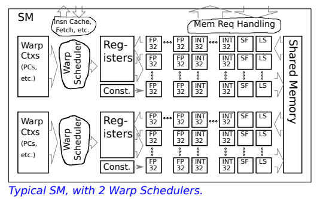

#### Functional Units

- CPU 可以通过重新调度指令来避免 stalls
  - 指令重排序: 将无关指令插入到有依赖关系的指令之间
  - 数据前递: 硬件层面的优化，允许数据在流水线中提前传递
    
- GPU 可以通过 线程切换（thread switching / warp scheduling） 来规避延迟带来的停顿。
  > GPU 有成百上千个线程（或 warp），当某个线程在等待功能单元结果时，GPU 可以直接调度另一个线程执行。这样，延迟不会直接影响整体吞吐量


#### Warp Contexts

warp contexts 的数量决定了 SM 上能同时并发的 block 数量


#### Warp Scheduler

- 硬件来决定哪个 wrap 将下一个执行
- **Branches and Warp Divergence**
  1. NVIDIA 7.0 之前，当 warp 遇到分支时，必须等到最外层的重新收敛点才能继续执行
  ```cpp
  if (condition) {
  // Branch A: 一些线程执行这里
  instruction_a1();
  instruction_a2();
  } else {
  // Branch B: 另一些线程执行这里
  instruction_b1();
  instruction_b2();
  instruction_b3(); // 更多指令
  }
  // 重新收敛点: 所有线程在这里汇合
  instruction_after_branch();
  ```
  2.  替代方案：调度器可以选择任意具有相同 PC 值的线程子集来执行，不需要等待最外层的收敛点
  ```shell
  时刻1: 调度器选择8个在Branch A的线程执行
  时刻2: 调度器选择16个在Branch B的线程执行
  时刻3: 调度器选择剩余的线程继续执行
  ...
  ```
  3. 问题
  - 仍需要为所有未 masked 的线程解码相同指令
    解码复杂度没有降低
  - 需要更复杂的调度逻辑，要追踪每个线程的状态，要决定最佳的线程子集组合
  - 每次都要计算最优的线程调度组合，增加了调度开销

### GPU Memory Hierarchy

- Global Memory: 全局内存的主要角色是为核函数提供数据，并在主机与设备及设备与设备之间传递数据
- Constant Memory: 特殊的常量内存缓存（constant cache）进行缓存读取，常量内存为只读内存
- Texture Memory & Surface Memory: 纹理内存和表面内存类似于常量内存，也是一种具有缓存的全局内存，有相同的可见范围和生命周期，而且一般仅可读(表面内存也可写)
- Register: 寄存器的速度是访问中最快的，但是它的容量较小。
- Local Memory: 局部内存是每个线程私有的内存空间，但从硬件来看，**局部内存只是全局内存的一部分**。所以，局部内存的延迟也很高
- Shared Memory: 共享内存是每个线程块（block）内所有线程共享的内存空间。共享内存的访问延迟远低于全局内存
- L1 / L2 Cache: L1 缓存是每个 SM 独有的，**而 L2 缓存是所有 SM 共享的**

{ width="600px" }

:laughing:**Summary**

- 每个 thread 都有自己的一份 register 和 local memory 的空间
- 同一个 block 中的每个 thread 则有共享的一份 share memory
- 所有的 thread (包括不同 block 的 thread) 都共享一份 global memory
- 不同的 grid 则有各自的 global memory。

  | 层级                      | 类型     | 特性                                   |
  | ------------------------- | -------- | -------------------------------------- |
  | Registers                 | 寄存器   | 每线程私有，延迟最低                   |
  | Shared Memory             | 共享内存 | 每 block 共享，低延迟 (~100x DRAM 快)  |
  | L1 / L2 Cache             | Cache    | SM 局部 / GPU 全局缓存                 |
  | Global Memory             | 全局内存 | 所有 SM 共享，延迟高 (~400-600 cycles) |
  | Constant / Texture Memory | 只读缓存 | 适合广播数据，缓存优化访存             |

### Warp

程序员为单个线程编写代码，但硬件层面会将线程组织成固定大小（32 个）的束，称为 Warp 。Warp 是 SM 上调度和执行的真正基本单位

- SIMT 执行：一个 Warp 中的所有 32 个线程在同一时刻执行相同的指令，但处理不同的数据。
- Warp 分化 (Warp Divergence)：如果一个 Warp 内的线程因条件判断而走向了不同的代码路径，硬件必须串行化执行这些路径
  > 它会首先为走向 if 分支的线程执行代码，屏蔽掉其他线程；然后再为走向 else 分支的线程执行代码。这种分化会严重降低性能，**因为在每个分支的执行过程中，总有一部分线程处于空闲状态** 。
- 延迟隐藏 (Latency Hiding)：当一个 Warp 停顿（例如，等待从全局内存读取数据）时，SM 上的 Warp 调度器会立即切换到另一个“准备就绪”的 Warp 来执行。

## CUDA 计算模型

CUDA 将计算任务组织成一个三级层次结构 。这是一个由程序员创建的、用于组织问题的**逻辑层次**，而非硬件的直接体现 。

- 线程 (Thread)：最基本的执行单位。单个线程执行一个 Kernel 函数的实例 。每个线程在其所属的线程块内拥有一个唯一的 ID(threadIdx)
- 线程块(Thread Block)：一组可以相互协作的线程（在现代架构上最多 1024 个）。一个块内的所有线程可以通过高速的片上   共享内存共享数据，并能通过`__syncthreads()`来协调它们的执行 。每个线程块在其所属的 Grid 内也拥有一个唯一的 ID(blockIdx)
- 网格 (Grid)：为执行单个 Kernel 而启动的所有线程块的集合 。一个 Grid 内的所有线程都可以访问同一个全局内存空间。Grid 内的线程块被假定为独立执行，且执行顺序不确定；它们之间没有直接的同步机制。

线程块和网格可以被组织成一维、二维或三维的结构，这为将计算任务映射到向量、矩阵、体数据等数据结构上提供了极大的便利 。  
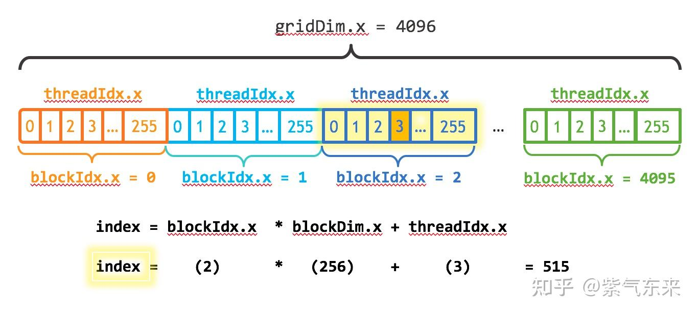{ width="600px" }

### Kernel 执行流程

- 当一个 Kernel 被启动时，由硬件调度器将 Grid 中的所有线程块分配到 GPU 上可用的 SM 中
- 一个 Thread Block 会被完整地分配给一个 SM，并在其上完整地执行。在其生命周期内，它不会被迁移到其他 SM
- 一个 SM 可以并发地执行多个 Thread Block，前提是它拥有足够的资源（如寄存器、共享内存）来容纳这些线程块
- 在 SM 内部，一个 Thread Block 的所有线程被划分为若干个 Warp（每组 32 个线程）。这些 Warp 才是被 SM 的 Warp 调度器实际调度执行的单元 。

这个映射关系是层级化的：`Grid -> GPU`，`Block -> SM`，`Thread -> Warp -> CUDA核心`

## CUDA Kernel 性能调优

## CUDA 常用优化技巧

### Maximize Compiler Computation

- Unroll Loops
  > 展开循环（loop unrolling），让循环体重复展开多次，**减少循环控制开销**（比如 i++、i<N 的判断），提高 GPU 的吞吐量。
- Write code using compile-time constants (not same as constant registers)
  > 在代码里用 编译期已知的常量来做索引、循环次数、数组大小等，而不是依赖 GPU 的常量寄存器

### Coalescing Memory Access

- 当一个 Warp 中的所有 32 个线程访问全局内存中的连续位置时，硬件可以将这 32 个小的请求“合并”成一个单一、大型、高效的内存事务
- Memory Access Patterns:

  - 合并访问（理想）：Warp 中的线程 i 访问内存地址 base + i。这在处理按行主序存储的矩阵的行时非常常见

    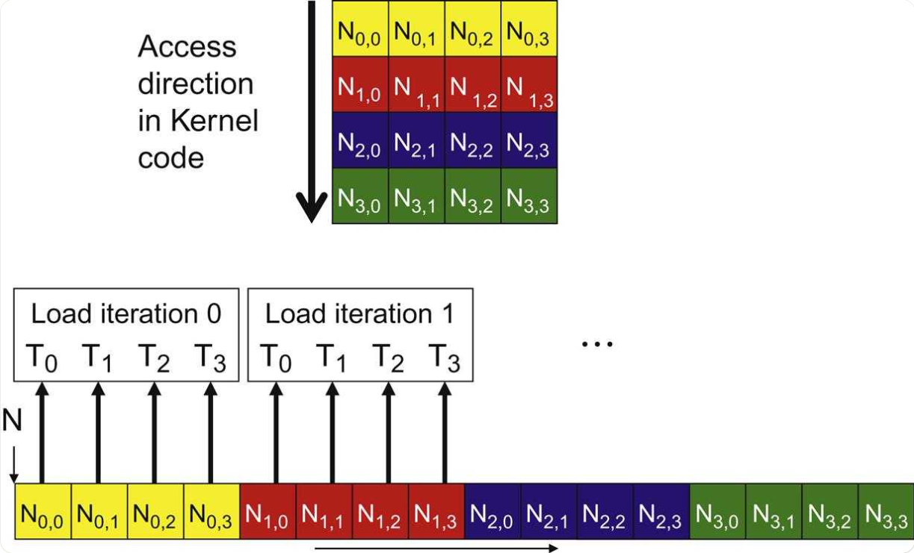{ width="500px" }

  - 跨步访问（问题）：线程 i 访问 base + i \* stride。如果步长（stride）很大，这将导致许多独立的、低效的内存事务。这在访问按行主序存储的矩阵的列时很常见

    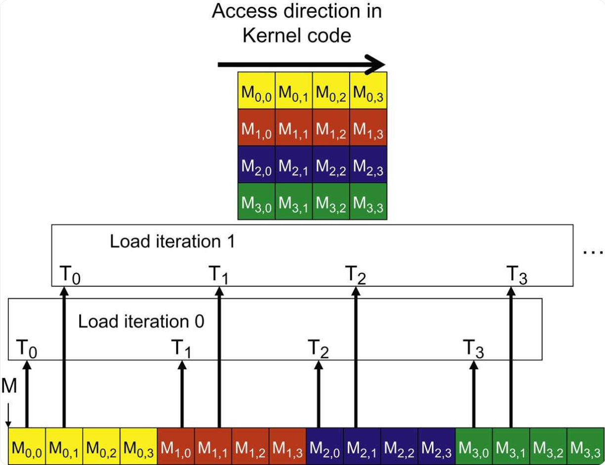{ width="500px" }

  - 非对齐访问：Warp 访问的起始地址未与内存事务的大小对齐

### Avoid Bank Conflicts in Shared Memory

:warning: Shared memory is organized into **32 banks**. Each bank is a slice of SRAM that can load or store **4 bytes of data every cycle**.
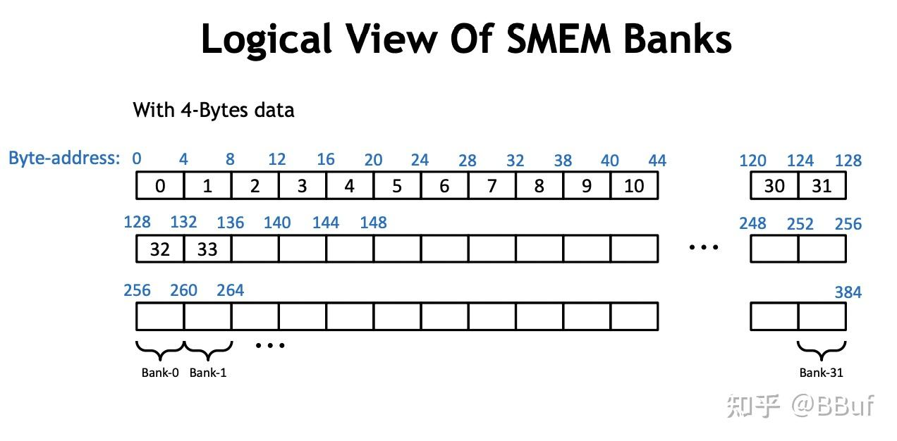{ width="500px" }

- 当一个 Warp 中的所有 32 个线程访问全局内存中的连续位置时，硬件可以将这 32 个小的请求“合并”成一个单一、大型、高效的内存事务
  { width="500px" }
- 当同一个 Warp 中的两个或更多线程试图访问位于同一个内存银行中的不同地址时，就会发生银行冲突 。此时，这些访问会被串行化处理，从而降低了共享内存的有效带宽
  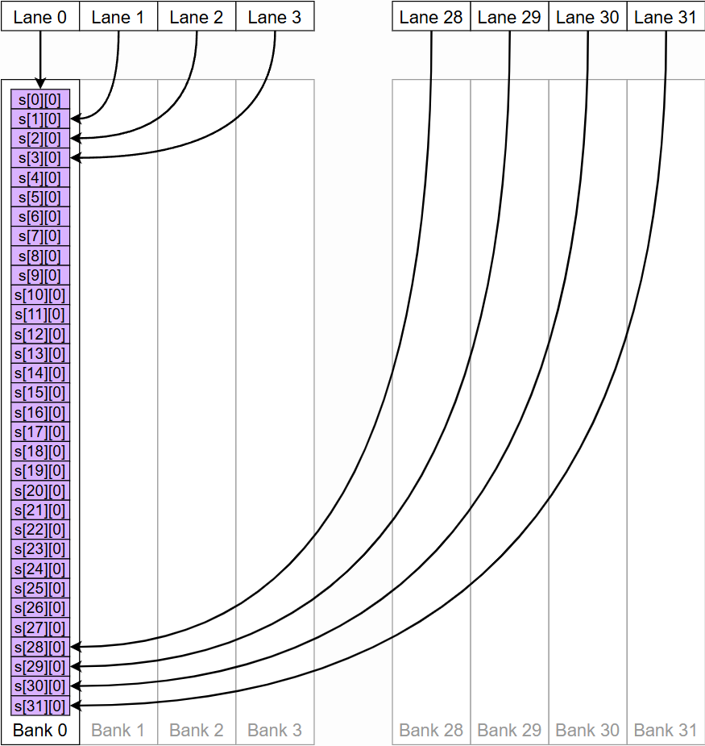{ width="500px" }

#### Solutions

- Padding: 在数据结构中插入填充元素，以改变数据在内存中的布局，避免多个线程访问同一银行
  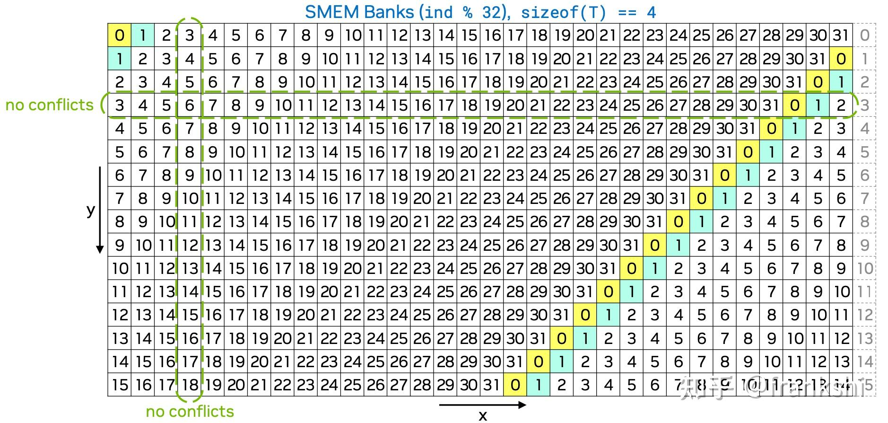{ width="500px" }
  - 可能降低 SM 的 occupancy
  - 可能地址访问不对齐，无法使用向量化访问
- **swizzling:** 重新组织数据的存储方式，使得并行访问时更少冲突(更常用):rocket:

  - 某些 swizzling 方法在从 shared memory 读数据到 register 时不能进行 float4 的合并读取

    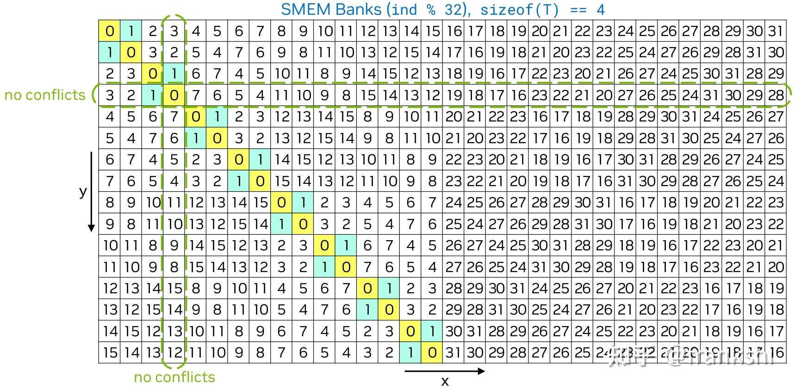{ width="600px" }

  - 逻辑位置表示元素在矩阵中的逻辑坐标。
  - 物理位置表示其对应元素在实际存储数据的 shared memory 中的位置坐标。

    > 当我们说读取矩阵的第 2 行第 3 列的元素，(2,3)就表示逻辑位置，而真正读取数据的时候，我们需要从实际存储数(2,1)的 shared memory 中对应的位置

    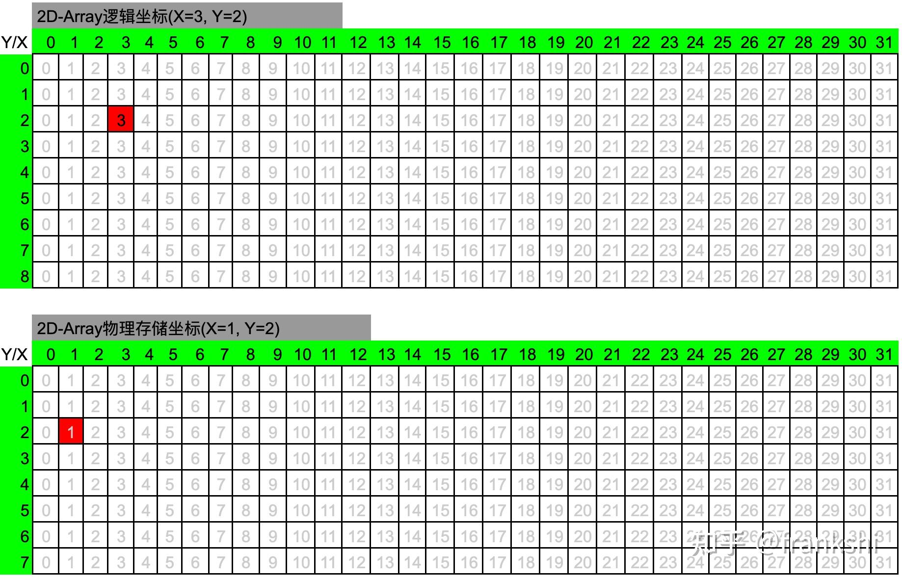{ width="600px" }

:warning: 广播 (Broadcast): 如果一个 Warp 中的所有线程访问同一个银行中的完全相同的地址，这是一种广播操作，不会产生冲突

#### Matmul Bank Conflict Avoidance Example

```cpp
const int warp_id = tid / 32;
const int lane_id = tid % 32;
const int a_tile_index =  warp_id / 2 * 16 + lane_id / 8 * 4
const int b_tile_index =  warp_id % 2 * 32 + lane_id % 8 * 4;
```

使用的是 4×2 的 warp 布局, warp 中的每个线程按照 4×8 进行排布, 每个 warp 对应 16×32 的数据

- 每个 wrap 32 个线程只获取 As 的 4\*4=16 个数据
- 每个 wrap 32 个线程只获取 Bs 的 8\*4=32 个数据
- shared memory 中有 32 个 bank，所以不会产生 bank conflict
  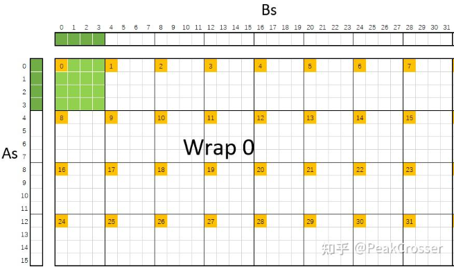

### Double Buffering

在共享内存中分配两个缓冲区: 当 SM 正在对缓冲区 1 中的数据进行计算时，硬件可以异步地将下一块数据从全局内存预取到缓冲区 2 中。一旦计算完成，两个缓冲区的角色互换。这种方式有效地将全局内存的访问延迟隐藏在了计算的背后

### Tile

- 将原本一行 × 一列的计算进行分块，每次只计算一块
- 一次性从全局内存中加载一小块 A (BM x BK) 和一小块 B (BK x BN) 到共享内存中
- 一个线程块内的所有线程就可以在共享内存上快速地进行大量的计算，以完成对应的一小块 C (BM x BN) 的计算
- 每个线程不再是只计算 C 块中的一个元素，而是负**责计算一个更小的结果网格**（图中是 2x2）。这样做可以进一步提升数据复用率和计算效率
  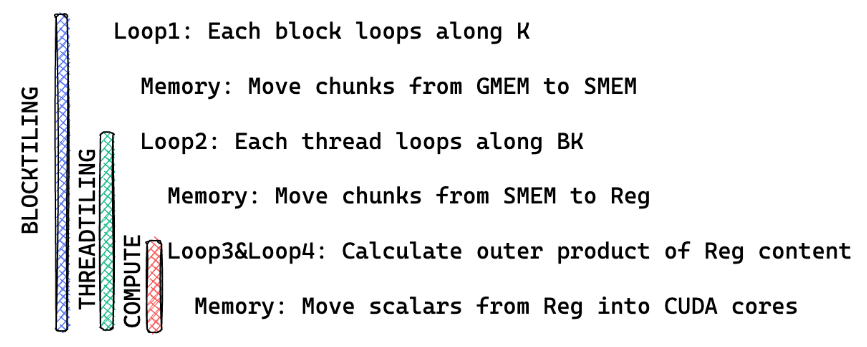{ width="600px" }
