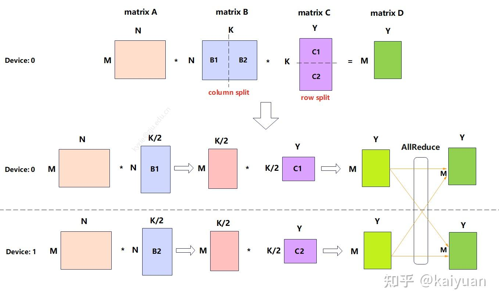
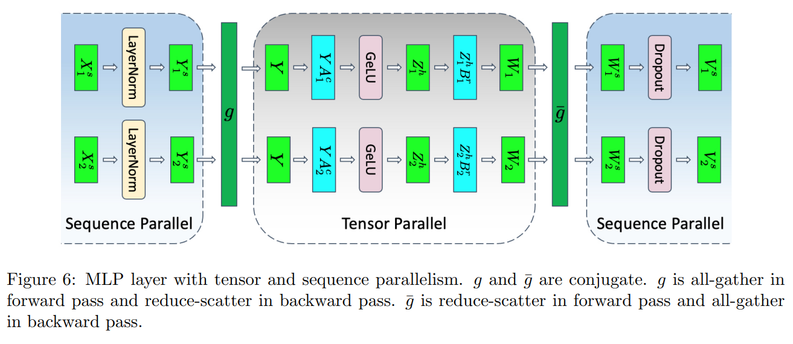
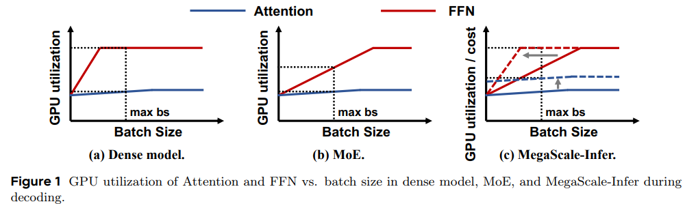
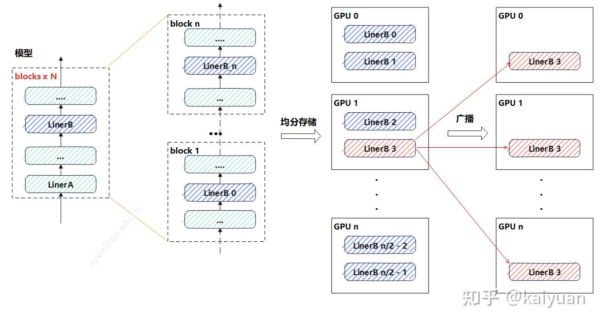
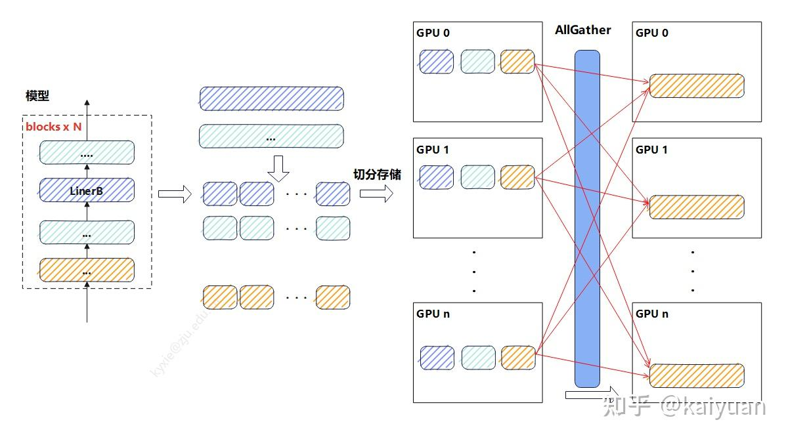
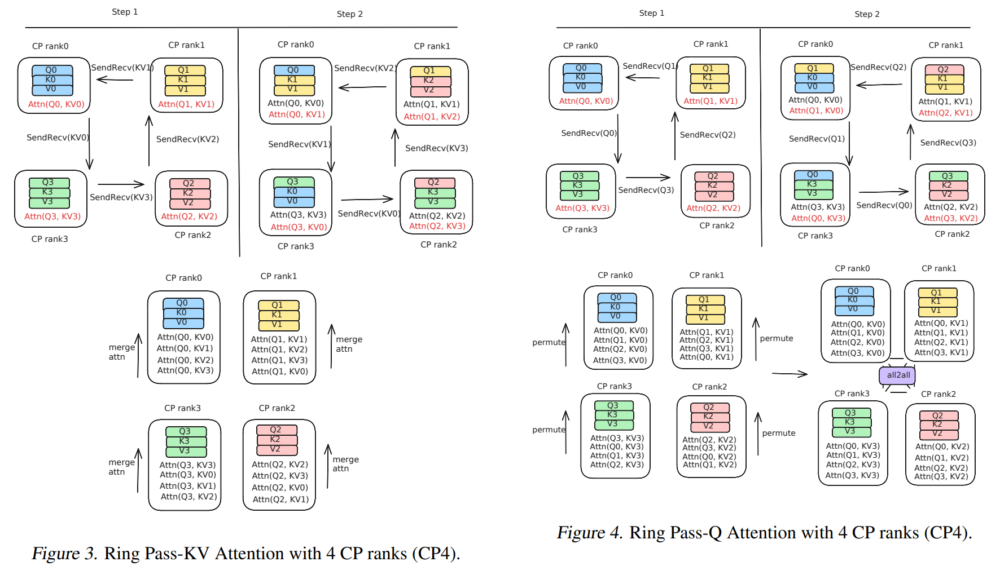
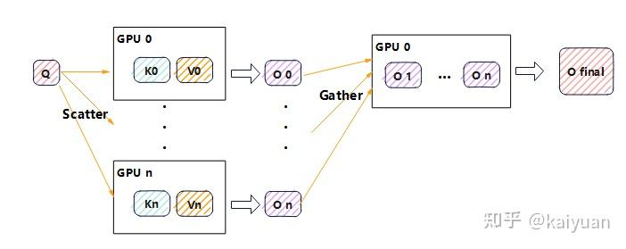
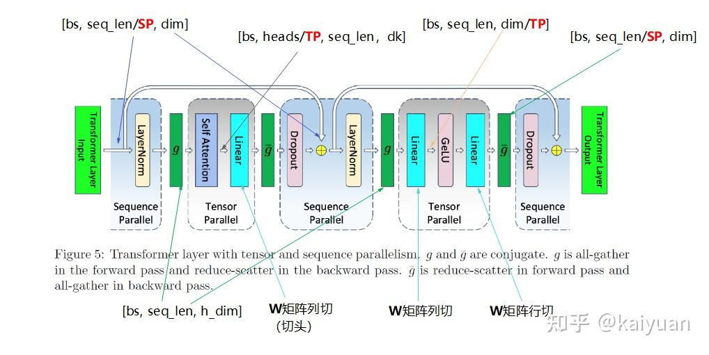

# Parallelization in LLM Inference

之前我们通过 cse234 课程的视角介绍了 MlSys 领域的并行化的基本概念，本文档将结合 LLM 推理的特点，介绍现在业界常用的并行化技术和策略。现在 LLM 基本是 Transformer-based 的自回归预训练模型，本文档中我们将主要介绍这种模型推理中的并行化技术。

> 我们这次通过 Transformer 中使用的各个模块的并行化来介绍 LLM 推理中的并行化技术。

## MatMul Parallelism

在 A x B x C 矩阵乘法场景，B 矩阵列切， C 矩阵行切。

- 计算量减半，多了一次集群通信（allReduce）中间值的存储大小减半，Input, Weight 减半

## 线性层并行

线性层的并行运算，包括层内切分、层间切分以及参数冗余消除，并行方式包括了数据并行（DP）、序列并行(SP)、张量并行（TP）、层并行（PP）、参数冗余消除（Zero）

### 层内并行

- DP: batch size 切分
- SP: seq len 切分
- TP: hidden size 切分
  $$ activation size:[batch\_size, seq\_len, hidden\_size]$$

SP 和 TP 通常一起使用，因为 **TP 仅仅切分了 weights**，而 input 没有切分，GPU 上仍然保存完整的 X 的 activation，而 **TP 则切分了 activation**

**Example**
megatron-v3 中使用 SP+TP 来减小 activation 的大小，TP 的计算过程类似 MatMul Parallelism 的描述

- 因为 GeLU 非线性，必须使用 allGather 来收集 activation
  

### 层间并行

Pipeline Parallelism，Expert Parallelism，Attention-FFN Decoupling

现在的普遍做法是 AFD(Attention-FFN Decoupling)，这是一种**层间异构并行策略**，把 Transformer 里的 Attention 和 MoE-FFN 拆开到不同设备上执行，以适配它们算力/显存需求的差异，从而提高推理吞吐和硬件利用率，MoE 的不同专家也分配到不同的 GPU 上

- Attention 是 Matmul+softmax+activation，通常是访存瓶颈（memory access bound）
- FFN 是占用显存大，算力要求高，通常表现为计算瓶颈（compute bound）
  

### 冗余参数消除

一般使用 ZeRO，将参数分散存储
模型参数较小时，一般选择参数广播

参数较大时，将每一层的权重 n 等分，每个 GPU 设备上面存一份，当需计算时将其 allgather 回来。

## Attention Parallelism

- DP: batch size
- TP: heads & $d_k$
- SP/CP(context parallelism): seq_len
  $$attention \space size: [batch\_size, heads, seq\_len, d_k]$$

Attention 的层间并行、冗余参数消除方式与线性层的方式一致，**层内并行的主要差异是 TP 和 SP**

### Sequence Parallelsim

- 只切分 Q 的序列
  Q 的切分后的尺寸为$[bs, heads, seq\_len/SP, head\_dim]$，按照 attention 计算：
  1. 求解 score，Q x K 相当于左矩阵行切，score 尺寸：$[bs, heads, seq\_len/SP, seq\_len]$
  2. softmax 求解的是最后一个维度，计算元素值相同，得到 attention_weights，
  3. attention_weights 与 V 进行矩阵乘，还是左矩阵行切运算，元素值相同，计算得到 O 的分块结果
  4. **将计算的 O 进行 allgather，结果相等**。

:warning: 虽然计算上可行，但每个 GPU 都需要一份完整的 K 和 V，没有节省下长序列带来的巨大 KV Cache 内存开销，这违背了 SP 的初衷。

- 只切分 K 的序列
  score 尺寸是$[bs, heads, seq\_len, seq\_len/SP]$，进一步计算 softmax，由于最后一个维度的数据只有之前的一半长度，而 softmax 的计算跟整个序列相关，直接拼接会导致结果不相等。所以，**单独切 K 序列后拼接，结果不等**
- 只切分 V 序列
  得到 attention_weights 尺寸完整，计算 attention_weights x V，因为 V 矩阵被行切，所以 attention_weights 需要列切(Matmul parallelism 的图)，**最后 allreduce 能够获得完整结果**

:warning: softmax 计算需要完整的 score 矩阵，内存瓶颈没有解决

- 当前常用的方式：QKV 按照相同方式切分，然后对计算结果进行修正，这个方法在 BlockwiseMulti-HeadAttention、ring attention、tree attention、merge attention 中都有应用，softmax 修正：
  - 数据协同切分：每个切分 Qi 要与所有的 Ki、Vi 进行一次计算，得到 Oi，尺寸均为$[bs, heads, seq\_len/N, head\_dim]$，$N$是 sp 的并行度
  - 分块计算与通信：每个$Rank_i$ 的目标是计算出它所负责的输出 $O_i$。要计算 $O_i$，$Q_i$ 必须和所有的 $K_j$ 与 $V_j$（其中 $j=0, 1, ..., N-1$）进行交互。这通过通信实现（例如，All-to-All 或者 Ring AllGather）。
  - 在线 Softmax 修正：在与每个 $K_j$, $V_j$ 块交互计算时，不能直接计算局部的 softmax 然后相加。必须使用一种**在线（Online）或流式（Streaming**的算法来迭代地更新 softmax 的结果，从而保证最终结果与全局计算完全一致。

#### prefill

推理的 prefill 阶段，Q 的序列长度与 KV 保持一致，**开启 SP 后 GPU 之间需要交换 KV 值与 Q 进行运算**（ring-attention 方式）

- 每个 rank 的 Q 与 KV 匹配计算完后获得三个输出值，然后进行结果修正得到$[O_{X0}, O_{X1}, O_{X2}]$，X 值为 rank 序号。最后每个 rank 将自己的分块结果进行聚合（加法）运算得到结果 $O_X$。
  

#### decode

在 decode 阶段 Q 的长度为 1，若对应的 KV 值分散在各个 GPU 设备中，可以将 Q 复制 N 份与切片的 KV 值进行 attention 计算后，最后将结果 gather 到一个设备上再计算修正结果。

- 这个方式意味着 GPU0 需要完成最大值、修正运算、求和运算，GPU0 可能成为瓶颈。一种 Tree attention 算法对过程做了改进，提升了通信效率。**就是把 gather 换成多次 allreduce，这种方式在跨节点场景中优势明显**。

### Tensor Parallelism

Attention 的张量并行分为两个部分:QKV 运算、线性投影运算。

QKV 运算的 TP 切分一般**针对 heads 维度**，相当于矩阵的并行的批量运算。

- attention 按照 heads 进行切分
- linear 按照 hidden_size / heads 进行切分
  
